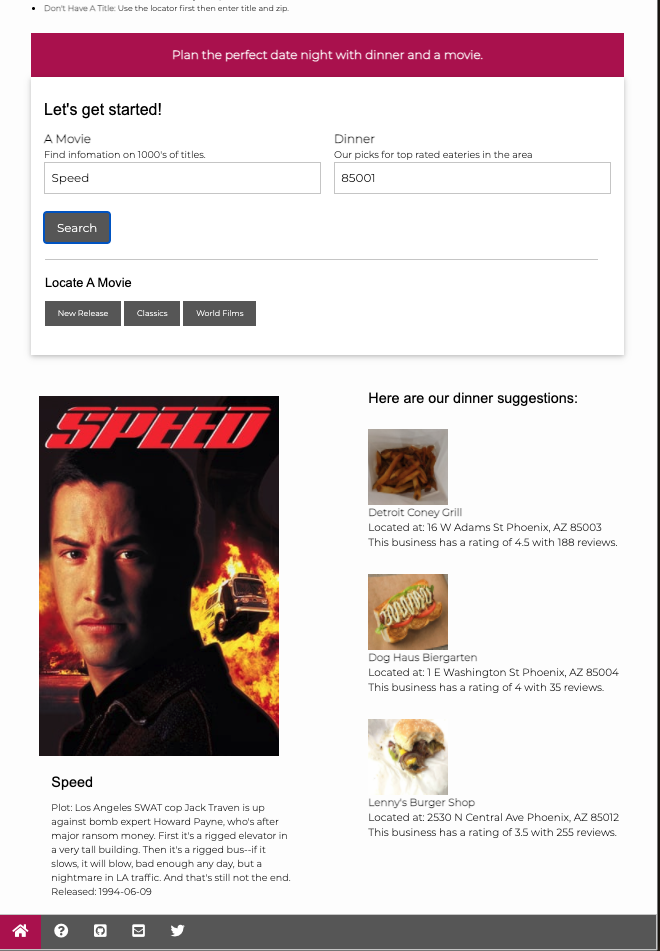
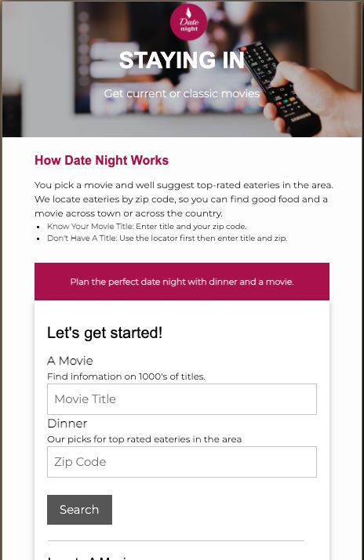

# Dinner-Movie-App

## Table of Contents
* [Description](#description)
* [Webpage-Images](#webpage-images)
* [Installation](#installation)
* [Usage](#usage)
* [Technologies-Used](#technologies-used)
* [Deployed-Link](#deployed-link)
* [Credits](#credits)
* [License](#license)

## Description

The Date night application is designed to help individuals plan the perfect dinner and a movie date. The application takes in the users movie choice and zip code in order to provide a curated list of restaurants that would best go with their movie choice.

The motivation for building this project was to create an application that seamlessly uses multiple server-side APIs that work with each other.

The reason for creating this application was to remove the burden of having to pick the right eatery when going on a dinner and a movie date. We wanted the task of having to choose the right place to eat the last of our user's worries.

## Webpage-Images

### Desktop Screenshot

### Desktop search example Screenshot

### Mobile Screenshot

## Installation

No prior installation is required to properly use the Date Night application. Simply head to the Deployed Link included towards the bottom of this README.

## Usage

1. On the main page of the application enter your movie title and your zip code in the corresponding fields.
1. Click the 'Search' button.
1. The movie image, title, plot summary, and release date will be displayed below the movie input field.
1. Three different eateries will be displayed under the zip code search area. This will display the restaurant's name, location, rating, and an image.

## Technologies-Used

* [Yelp api](https://www.yelp.com/developers/documentation/v3)
* [TMDB api](https://www.themoviedb.org/documentation/api)
* [W3.CSS Framework](https://www.w3schools.com/w3css/default.asp)

## Deployed-Link

https://tiffcrockett.github.io/Dinner-Movie-App/

## Previous repo

https://github.com/roseannenguyen/Date-Night-API
https://roseannenguyen.github.io/Date-Night-API/

## Credits

* [Tiffany Crockett](https://github.com/tiffcrockett)
* [Roseanne Nguyen](https://github.com/roseannenguyen)
* [Martin Mondaca](https://github.com/martinmondaca)

## License

Licensed under [MIT](https://choosealicense.com/licenses/mit/) license.
